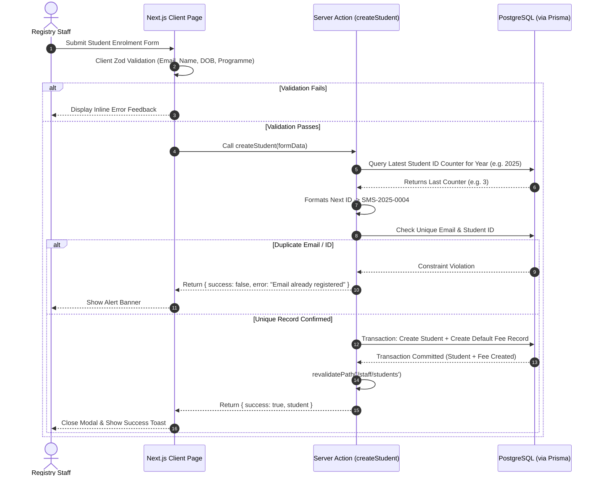
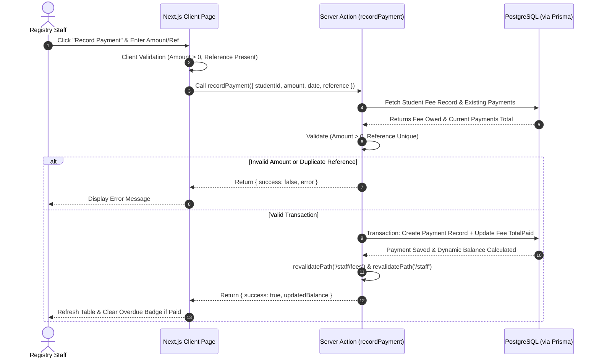
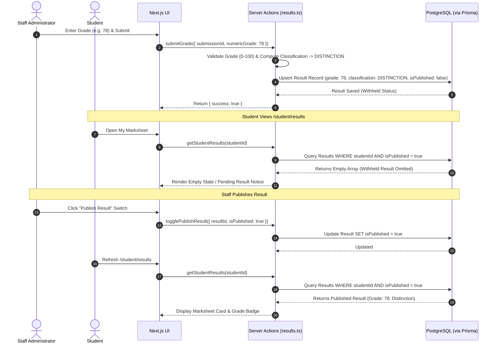

# 4. User Journey & Technical Flow

## 4.1 Overview

This document specifies the technical execution flows and end-to-end user journeys for the four core Registry workflows:
1. **Student Enrolment Workflow**
2. **Fees & Payments Workflow**
3. **Assessment Submission Workflow**
4. **Marksheet & Results Workflow**

Each workflow is detailed with user actions, frontend validation checks, server action processing, database mutations, and resulting state changes.

---

## 4.2 Workflow 1: Student Enrolment Flow

### User Journey
1. Registry Staff navigates to `/staff/students`.
2. Staff clicks **"Enroll New Student"** modal trigger.
3. Staff fills in the form: Full Name, Email, Date of Birth, Programme, Academic Year, and Enrolment Status (`Enrolled`, `Deferred`, `Withdrawn`, `Completed`).
4. System validates inputs (email format, non-empty fields, valid dates).
5. System auto-generates a unique Student ID (e.g. `SMS-2025-0004`).
6. System checks for duplicate email or Student ID.
7. Record is persisted in PostgreSQL via Prisma, and automatically creates an initial tuition fee record based on the selected Programme fee structure.
8. UI updates instantly with success notification and revalidated student directory table.

### Technical Sequence Flow Diagram



---

## 4.3 Workflow 2: Fees & Payments Flow

### User Journey
1. Staff navigates to `/staff/fees`.
2. Staff views student financial cards/table showing: Assigned Fee, Total Paid, and Outstanding Balance (`Assigned Fee - Total Paid`).
3. If `Outstanding Balance > 0` and payment is past due date, system automatically flags student with `OVERDUE` badge.
4. Staff clicks **"Record Payment"** for a specific student.
5. Staff inputs: Payment Amount (£), Payment Date, and Payment Reference Number (e.g. `PAY-99214`).
6. System validates: Amount > 0, non-empty reference, valid date.
7. System records payment transaction in database.
8. System recalculates `Total Paid` and `Outstanding Balance` dynamically.
9. Dashboard metrics and student finance badges update in real time.

### Technical Sequence Flow Diagram



---

## 4.4 Workflow 3: Assessment Submission Flow

### User Journey
1. Student switches to Student View (`/student/assessments`).
2. Student views open assessments with module names, titles, and submission deadlines.
3. Student selects an assessment and attaches a deliverable file (`.pdf` or `.docx`).
4. Client checks file extension and file size (< 10MB).
5. Student clicks **"Submit Deliverable"**.
6. Server processes file upload, checks current timestamp against assessment deadline.
7. If submission timestamp > deadline: status is set to `SUBMITTED`, with `isLate = true`.
8. If prior submission exists and deadline has NOT passed: system replaces active submission file reference (`isResubmission = true`).
9. Student UI updates with confirmation badge (`On Time` or `Late Substituted`).

### Technical Sequence Flow Diagram

```mermaid
sequenceDiagram
    autonumber
    actor Student as Student
    participant UI as Student Portal UI
    participant Action as Server Action (submitAssessment)
    participant FS as Storage (public/uploads)
    participant DB as PostgreSQL (via Prisma)

    Student->>UI: Attach File & Click "Submit Work"
    UI->>UI: Validate Extension (.pdf / .docx)
    UI->>Action: Send FormData (assessmentId, studentId, file)
    Action->>DB: Fetch Assessment (Deadline, Active Status)
    DB-->>Action: Returns Assessment Details
    Action->>DB: Check Existing Submissions for Student + Assessment
    DB-->>Action: Returns Existing Submission (if any)
    alt Resubmission after Deadline
        Action-->>UI: Return { success: false, error: "Deadline passed; resubmission disallowed." }
        UI-->>Student: Display Error Banner
    else Allowed Submission / Resubmission
        Action->>FS: Save File to /public/uploads/assessments/
        FS-->>Action: Return Saved File Path
        Action->>Action: Compare Current Time vs Assessment Deadline -> Compute isLate
        Action->>DB: Upsert Submission Record (filePath, submittedAt, isLate)
        DB-->>Action: Submission Record Saved
        Action->>Action: revalidatePath('/student/assessments')
        Action-->>UI: Return { success: true, submission }
        UI-->>Student: Show Success Badge & Submission Timestamp
    end
```

---

## 4.5 Workflow 4: Marksheet & Results Flow

### User Journey
1. Staff navigates to `/staff/results`.
2. Staff views list of student assessment submissions.
3. Staff inputs numeric grade (`0–100`) for a student submission.
4. Server validates range `0 <= Grade <= 100` and automatically computes classification:
   - `70–100`: **Distinction**
   - `60–69`: **Merit**
   - `40–59`: **Pass**
   - `0–39`: **Fail**
5. Result is saved in PostgreSQL with default state `isPublished = false` (**Withheld**).
6. Staff reviews grade and clicks **"Publish Result"** switch.
7. Server updates `isPublished = true`.
8. Student switches to `/student/results`. Only published results are queried and displayed on the student marksheet card.

### Technical Sequence Flow Diagram


