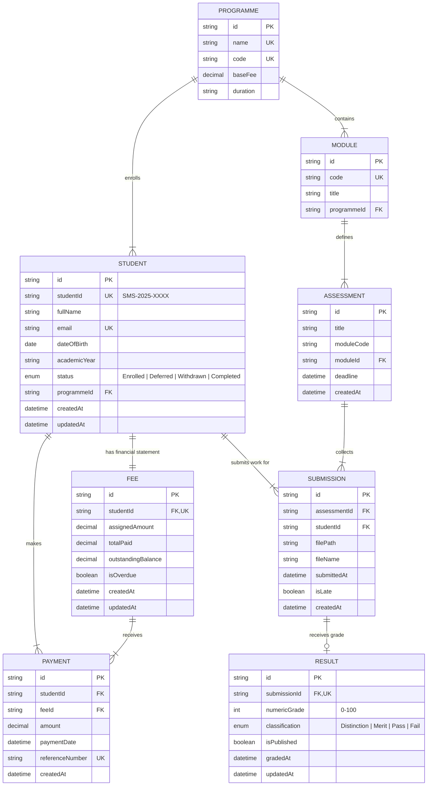

# 6. Database ERD & Relationship Design

## 6.1 Entity Overview

The Student Management System — Registry Module database models 8 primary entities to capture the complete academic and registry lifecycle:

1. `Programme`: Academic qualification degree (e.g. BSc Computer Science) with standard tuition fee structure.
2. `Student`: Core registry profile record with unique Student ID (`SMS-2025-XXXX`) and enrolment status.
3. `Fee`: Financial obligation record linking a student to their programme tuition fee.
4. `Payment`: Individual payment transactions recorded against a student fee balance.
5. `Module`: Academic course module belonging to a programme (e.g. CS101 Web Development).
6. `Assessment`: Specific graded assignment belonging to a module with title and deadline.
7. `Submission`: Student uploaded file deliverable for an assessment with submission timestamp and late status.
8. `Result`: Academic grade entry for a submission containing numeric score, automatic classification, and publication visibility toggle.

---

## 6.2 Entity-Relationship Diagram (ERD)

---

## 6.3 Detailed Entity Specifications & Cardinality

### 1. `Programme` ↔ `Student` (1 : N)
- **Cardinality**: One programme can have many enrolled students. Each student belongs to exactly one programme.
- **Relational Integrity**: Deleting a programme is restricted (`ON DELETE RESTRICT`) if enrolled students exist.

### 2. `Student` ↔ `Fee` (1 : 1)
- **Cardinality**: Each student has exactly one financial fee summary record.
- **Relational Integrity**: When a student is created, an associated `Fee` record is initialized automatically (`ON DELETE CASCADE`).

### 3. `Fee` / `Student` ↔ `Payment` (1 : N)
- **Cardinality**: One student/fee summary can accumulate multiple payment transactions over time.
- **Relational Integrity**: Deleting a student cascades deletion to their payment transaction history (`ON DELETE CASCADE`).

### 4. `Programme` ↔ `Module` (1 : N)
- **Cardinality**: One academic programme contains multiple modules.
- **Relational Integrity**: Modules reference their host programme (`ON DELETE RESTRICT`).

### 5. `Module` ↔ `Assessment` (1 : N)
- **Cardinality**: One module can set multiple assessments across the academic term.
- **Relational Integrity**: Deleting a module deletes its associated assessments (`ON DELETE CASCADE`).

### 6. `Assessment` & `Student` ↔ `Submission` (N : M via `Submission` entity)
- **Cardinality**: An assessment receives submissions from multiple students. A student submits to multiple assessments.
- **Unique Constraint**: A compound unique index `@@unique([assessmentId, studentId])` enforces the **One Active Submission Rule** per student per assessment (with resubmission replacing/updating the existing record).

### 7. `Submission` ↔ `Result` (1 : 0..1)
- **Cardinality**: A submission may have 0 or 1 academic result record.
- **Relational Integrity**: A result belongs uniquely to one submission (`submissionId` is UNIQUE). Deleting a submission cascades deletion to its result (`ON DELETE CASCADE`).
